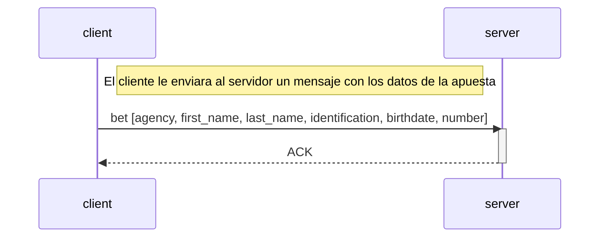

# TP0: Docker + Comunicaciones + Concurrencia

## Parte 1: Docker

### Ejercicio 1

Para generar el archivo de docker-compose con una cantidad determinada de clientes, se debe correr el siguiente comando:

```bash
bash generar-compose.sh <docker-compose-dev.yaml> <clients_num>
```

### Ejercicio 2

Para evitar tener que hacer un nuevo build de las imágenes de Docker cada vez que se quiera cambiar la configuración del cliente o del servidor, se modificó el archivo docker-compose, así como también el script `generar-compose.sh`. Para esto se agregaron bind mounts a los servicios de cliente y servidor.

Al mapear el archivo de configuración local (config.yaml o config.ini) con un archivo dentro del contenedor, los cambios en el archivo local se reflejan inmediatamente dentro del contenedor sin tener que hacer un nuevo build. Esto evita tener que hacer un nuevo build de las imágenes de Docker cada vez que se quiera cambiar la configuración.

A su vez, se añadió un archivo `.dockerignore` con el siguiente contenido para evitar que se copien los archivos de configuración al contenedor:

```
client/config.yaml
server/config.ini
```

### Ejercicio 3

Para verificar el correcto funcionamiento del servidor, se creó un script de bash `validar-echo-server.sh` que utiliza el comando netcat para interactuar con el mismo.
Para poder ejecutar el script, se debe correr el siguiente comando:

```bash
./validar-echo-sever.sh
```

Es importante tener en cuenta que el servidor debe estar corriendo para poder realizar la validación, por lo que se debe levantar el contenedor del servidor antes de ejecutar el script. Para esto, correr el siguiente comando previamente:

```bash
make docker-compose-up
```

### Ejercicio 4

Para poder hacer un graceful shutdown, del lado del cliente, se utilizó el paquete `os/signal`, que permite capturar la señal SIGTERM y verificar que el contexto del cliente no haya sido cancelado. En caso de que haya sido cancelado, se cierra la conexión con el servidor.

Para el servidor, se utilizó el paquete `signal`, que permite capturar la señal SIGTERM y cerrar la conexión con el cliente. En caso de recibir la señal SIGTERM, se cierra la conexión con el cliente y se cierra el socket del servidor.

handleSigterm en el servidor:

### Ejercicio 5

Los datos de las apuestas se reciben como variables de entorno, las cuales están definidas en el docker-compose.
Para enviar cada apuesta, se definió el siguiente protocolo de aplicación y se utilizó TCP como protocolo de transporte, ya que necesitamos asegurar que se envíen correctamente todos los datos de la apuesta.



El cliente envía la apuesta en un mensaje que contiene un header de 4 bytes, en el cual se define la longitud de la apuesta en bytes. Este header es útil para poder saber que cantidad de bytes tendrá que leer el server por cada mensaje.
El payload está compuesto por todos los elementos de la apuesta separados por ',' (coma), por lo que se serializan encodeados y se parsean como UTF-8, y tiene esta estructura:

```
<agency>,<first_name>,<last_name>,<identification>,<birthdate>,<number>
```

La lógica de las apuestas se encuentra en el archivo bet.go, permitiendo separar las responsabilidades entre el modelo de dominio y la capa de comunicación.
Una vez que el cliente envía la apuesta, espera la confirmación del servidor (ACK) para cerrar su conexión con el servidor y el archivo de apuestas.

### Ejercicio 6

Para enviar las apuestas de a chunks, se toma la cantidad de apuestas a enviar de la variable `maxAmount`, que se encuentra definida en el archivo `config.yaml`. Si el tamaño total de las apuestas supera los 8KB, se reducirá en 3/4 la cantidad de apuestas a enviar, hasta que el tamaño total de las apuestas no supere los 8KB.
A fin de no leer el archivo completo en memoria, se estableció una cantidad máxima de apuestas leídas en cada iteración, de aproximadamente 8KB.

De manera similar a lo que se hizo en el ejercicio 5, se definió un protocolo de aplicación para enviar los chunks de apuestas, que se envían como mensajes cuyo header contiene 2 bytes para el tamaño en bytes del payload. Dicho payload contiene los mensajes de las apuestas definidos en el ejercicio 5 (2 bytes para la longitud + payload).

Por cada chunk de apuestas enviado, el cliente espera la confirmación del servidor (ACK) para enviar el siguiente chunk. Una vez que se envían todas las apuestas, se cierra la conexión con el servidor.

Por otro lado, el servidor procesa el chunk de apuestas y lo almacena en una lista de apuestas, que luego se guarda en un archivo bet.csv.

### Ejercicio 7

Para notificar al servidor que todas las apuestas han sido enviadas, se agregó un byte adicional al inicio del mensaje en el ejercicio 6. Este byte funciona como un booleano e indica si el mensaje contiene las últimas apuestas (1) o no (0). De este modo, el servidor puede determinar cuándo ha recibido todas las apuestas de un cliente, dejar de esperar nuevos mensajes y procesar las apuestas de otros clientes.

Una vez que el servidor recibe todas las apuestas de todos los clientes, procede con el sorteo, buscando en el archivo de apuestas las apuestas ganadoras, y enviando los dni de las personas ganadoras a cada cliente. Finalmente, deja de aceptar nuevas conexiones y cierra el socket.

Al recibir los dni de las personas que ganaron la apuesta de la agencia, el cliente cierra la conexión con el servidor y el archivo de apuestas.

### Ejercicio 8

Dado que Python tiene una limitación conocida como Global Interpreter Lock (GIL), que impide la ejecución verdaderamente paralela de múltiples threads en tareas intensivas en CPU decidí utilizar multiprocessing en lugar de multithreading. Cada proceso corre en su propio intérprete de Python, lo que permite una ejecución en paralelo sin las restricciones del GIL, permitiendo aprovechar mejor los múltiples núcleos de la CPU.

Por cada conexión de un cliente, se crea un proceso hijo que funciona como un manejador de la conexión, y se encarga de recibir las apuestas del cliente y procesarlas, de manera similar al ejercicio anterior. Para poder sincronizar a los procesos hijos a fin de esperar a que todos los clientes hayan enviado sus apuestas, se utilizó una Barrera de sincronización, cuyo contador se decrementa cada vez que un cliente envía todas sus apuestas. Es decir, cuando el servidor recibe un mensaje con el primer bit en 1, tal como se explicó en el ejercicio anterior. Una vez que el contador llega a 0, todos los procesos hijos pueden comenzar con el sorteo. Esto es, cada proceso busca en el archivo de apuestas las apuestas ganadoras de la agencia respectiva a la que le hace handle, y envía los dni de los ganadores.

Como todos los procesos hijos tienen que acceder al archivo de apuestas, se utilizó un lock para evitar condiciones de carrera.

Al recibir los dni de las personas que ganaron la apuesta de la agencia, el cliente cierra la conexión con el servidor y el archivo de apuestas.

Finalmente, el proceso padre cierra el socket y se encarga de hacer join a todos los procesos hijos para esperar a que terminen de ejecutarse.
