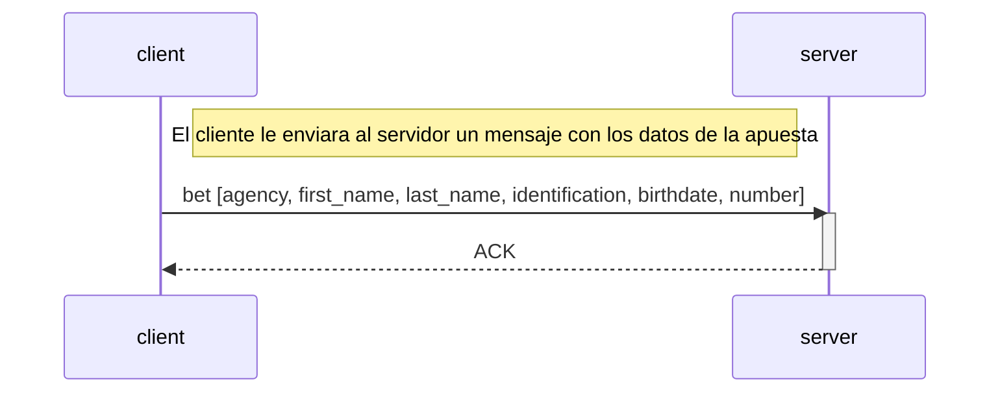

# TP0: Docker + Comunicaciones + Concurrencia

## Parte 1: Docker

### Ejercicio 1

Para generar el archivo de docker-compose con una cantidad determinada de clientes, se debe correr el siguiente comando:

```bash
bash generar-compose.sh <docker-compose-dev.yaml> <clients_num>
```

### Ejercicio 2

Para evitar tener que hacer un nuevo build de las imágenes de Docker cada vez que se quiera cambiar la configuración del cliente o del servidor, se modificó el archivo docker-compose, así como también el script `generar-compose.sh`. Para esto se agregaron bind mounts a los servicios de cliente y servidor.

Al mapear el archivo de configuración local (config.yaml o config.ini) con un archivo dentro del contenedor, los cambios en el archivo local se reflejan inmediatamente dentro del contenedor sin tener que hacer un nuevo build.

A su vez, se añadió un archivo `.dockerignore` con el siguiente contenido para evitar que se copien los archivos de configuración al contenedor:

```
client/config.yaml
server/config.ini
```

### Ejercicio 3

Para verificar el correcto funcionamiento del servidor, se creó un script de bash `validar-echo-server.sh` que utiliza el comando netcat para interactuar con el mismo.
Para poder ejecutar el script, se debe correr el siguiente comando:

```bash
./validar-echo-server.sh
```

Es importante tener en cuenta que el servidor debe estar corriendo para poder realizar la validación, por lo que se debe levantar el contenedor del servidor antes de ejecutar el script. Para esto, correr el siguiente comando previamente:

```bash
make docker-compose-up
```

### Ejercicio 4

Para poder hacer un graceful shutdown, del lado del cliente, se utilizó el paquete `os/signal`, que permite capturar la señal SIGTERM y verificar que el contexto del cliente no haya sido cancelado. En caso de que haya sido cancelado, se cierra la conexión con el servidor.

Para el servidor, se utilizó el paquete `signal`, que permite capturar la señal SIGTERM y cerrar la conexión con el cliente. En caso de recibir la señal SIGTERM, se cierra la conexión con el cliente y se cierra el socket del servidor.

En el cliente, se cambia el uso de `time.Sleep` por un `select` que monitorea tanto el contexto como un `time.After`. De este modo, si el contexto es cancelado, el `select` ejecuta el `case` correspondiente y finaliza el proceso de manera correcta. En caso contrario, el cliente sigue esperando a que se complete el tiempo del `sleep` antes de volver a ejecutar el bucle.

Mientras tanto, del lado del servidor, si se recibe una señal SIGTERM, se cierra la conexión con el cliente si está activa y se cierra el socket del servidor.

### Ejercicio 5

Los datos de las apuestas se reciben como variables de entorno, las cuales están definidas en el docker-compose.
Para enviar cada apuesta, se definió el siguiente protocolo de aplicación y se utilizó TCP como protocolo de transporte, ya que necesitamos asegurar que se envíen correctamente todos los datos de la apuesta.



El cliente envía la apuesta en un mensaje que contiene un header de 4 bytes, en el cual se define la longitud de la apuesta en bytes. Este header es útil para poder saber que cantidad de bytes tendrá que leer el server por cada mensaje, cuya estructura se define a continuación:

```
<bytes_length><agency>,<first_name>,<last_name>,<identification>,<birthdate>,<number>
```

Donde todos los elementos de la apuesta separados por ',' (coma)

La lógica de las apuestas se encuentra en el archivo /clients/common/bet.go, permitiendo separar las responsabilidades entre el modelo de dominio y la capa de comunicación.
Una vez que el cliente envía la apuesta, espera la confirmación del servidor (ACK) para cerrar su conexión con el servidor y el archivo de apuestas.
