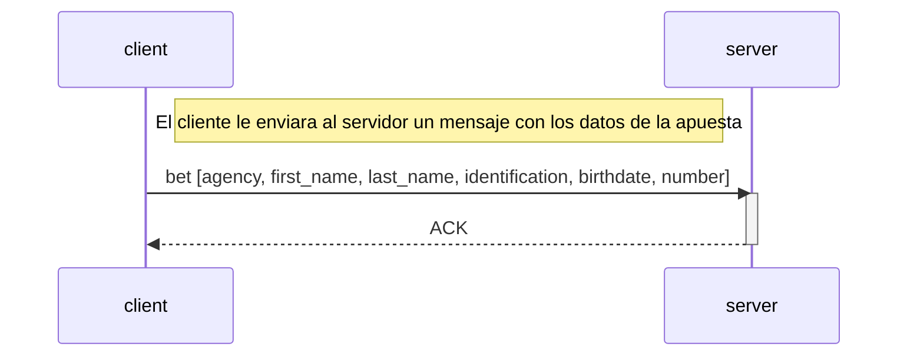

# TP0: Docker + Comunicaciones + Concurrencia

## Parte 1: Docker

### Ejercicio 1

Para generar el archivo de docker-compose con una cantidad determinada de clientes, se debe correr el siguiente comando:

```bash
bash generar-compose.sh <docker-compose-dev.yaml> <clients_num>
```

### Ejercicio 2

Para evitar tener que hacer un nuevo build de las imágenes de Docker cada vez que se quiera cambiar la configuración del cliente o del servidor, se modificó el archivo docker-compose, así como también el script `generar-compose.sh`. Para esto se agregaron bind mounts a los servicios de cliente y servidor.

Al mapear el archivo de configuración local (config.yaml o config.ini) con un archivo dentro del contenedor, los cambios en el archivo local se reflejan inmediatamente dentro del contenedor sin tener que hacer un nuevo build. Esto evita tener que hacer un nuevo build de las imágenes de Docker cada vez que se quiera cambiar la configuración.

A su vez, se añadió un archivo `.dockerignore` con el siguiente contenido para evitar que se copien los archivos de configuración al contenedor:

```
client/config.yaml
server/config.ini
```

### Ejercicio 3

Para verificar el correcto funcionamiento del servidor, se creó un script de bash `validar-echo-server.sh` que utiliza el comando netcat para interactuar con el mismo.
Para poder ejecutar el script, se debe correr el siguiente comando:

```bash
./validar-echo-sever.sh
```

Es importante tener en cuenta que el servidor debe estar corriendo para poder realizar la validación, por lo que se debe levantar el contenedor del servidor antes de ejecutar el script. Para esto, correr el siguiente comando previamente:

```bash
make docker-compose-up
```

### Ejercicio 4

Para poder hacer un graceful shutdown, del lado del cliente, se utilizó el paquete `os/signal`, que permite capturar la señal SIGTERM y verificar que el contexto del cliente no haya sido cancelado. En caso de que haya sido cancelado, se cierra la conexión con el servidor.

Para el servidor, se utilizó el paquete `signal`, que permite capturar la señal SIGTERM y cerrar la conexión con el cliente. En caso de recibir la señal SIGTERM, se cierra la conexión con el cliente y se cierra el socket del servidor.

handleSigterm en el servidor:

### Ejercicio 5

Los datos de las apuestas se reciben como variables de entorno, las cuales están definidas en el docker-compose.
Para enviar cada apuesta, se definió el siguiente protocolo: 

El cliente envía la apuesta en un mensaje que contiene un header de 4 bytes en el cual se define la longitud del payload, y un payload con una cantidad de bytes determinada por la variable `maxAmount`, definida en el archivo de configuración (máximo 8KB). Este header es útil para poder saber que cantidad de bytes tendrá que leer el server por cada mensaje.
El payload está compuesto por todos los elementos de la apuesta separados por ',' (coma), por lo que se envían encodeados como UTF-8.

### Ejercicio 6

- Cliente

  - Lee el archivo de apuestas de a chunks de tamaño fijo, de 8kb.
  - Envia el chunk de apuestas al servidor, que se envía como un mensaje cuyo header contiene el tamaño del payload.
  - Espera la confirmación del servidor (ACK) para enviar el siguiente chunk.
  - Cuando se envían todas las apuestas, se cierra la conexión.

- Servidor
  - Recibe el chunk de apuestas del cliente, que se recibe como un mensaje cuyo header contiene el tamaño del payload.
  - Procesa el chunk de apuestas y lo almacena en una lista de apuestas, que luego se guarda en un archivo bet.csv.
  - Confirma la recepción del chunk de apuestas al cliente (ACK).

### Ejercicio 7

- Cliente

  - Lee el archivo de apuestas de a chunks de tamaño fijo, de 8kb.
  - Envia el chunk de apuestas al servidor, que se envía como un mensaje cuyo header de un byte contiene el tamaño del payload.
  - Espera la confirmación del servidor (ACK) para enviar el siguiente chunk.
  - Cuando se envían todas las apuestas, queda esperando la respuesta del servidor.
  - Recibe los dni de las personas que ganaron la apuesta de la agencia como un mensaje cuyo header de un byte contiene el tamaño del payload.

- Servidor
  - Recibe el chunk de apuestas del cliente, que se recibe como un mensaje cuyo header contiene el tamaño del payload.
  - Procesa el chunk de apuestas y lo almacena en una lista de apuestas, que luego se guarda en un archivo bet.csv.
  - Confirma la recepción del chunk de apuestas al cliente (ACK).
  - Busca en el archivo de apuestas las apuestas ganadoras de la agencia y las envía los dni de las personas correspondientes al cliente.
